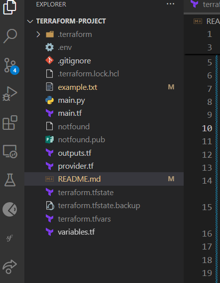
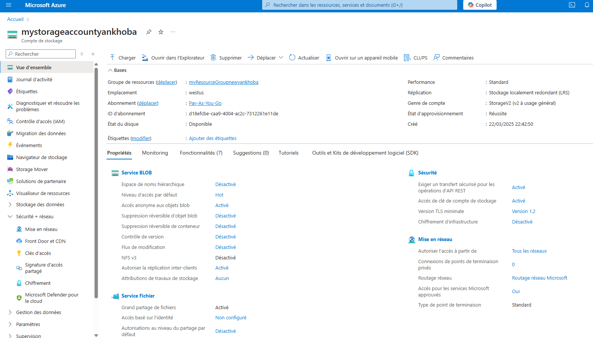
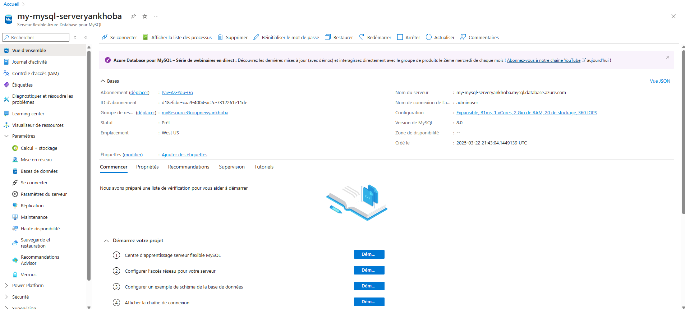
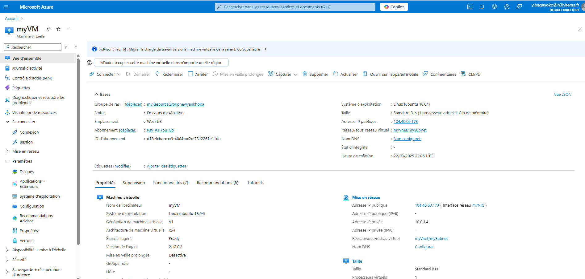

# Mini-Projet : Déploiement Automatisé d’une Infrastructure Cloud avec Terraform

## Objectif
L'objectif de ce mini-projet était de déployer une infrastructure cloud automatisée sur Azure en utilisant Terraform. L'infrastructure comprend une machine virtuelle (VM), un stockage Blob, une base de données MySQL flexible, et une application Node.js déployée sur la VM.

---

## Étapes Réalisées

### Étape 1 : Préparer l’Environnement Terraform
- **Installation de Terraform** : Terraform a été installé et configuré pour interagir avec Azure.
- **Création des fichiers Terraform** :
  - `main.tf` : Contient la définition des ressources Azure (groupe de ressources, VM, stockage, base de données, etc.).
  - `variables.tf` : Déclare les variables utilisées dans le projet (non présent dans le code fourni, mais recommandé pour une meilleure gestion).
  - `outputs.tf` : Affiche les informations utiles après le déploiement (non présent dans le code fourni, mais recommandé pour récupérer l'IP publique, etc.).
  - `provider.tf` : Configure le provider Azure (intégré dans `main.tf` dans ce cas).
---

*Capture d'écran du compte de stockage Blob dans le portail Azure.*

### Étape 2 : Déployer l’Infrastructure
1. **Création du groupe de ressources** :
   - Un groupe de ressources nommé `myResourceGroupnewyankhoba` a été créé dans la région `West US`.

2. **Création du compte de stockage** :
   - Un compte de stockage Blob nommé `mystorageaccountyankhoba` a été créé avec une réplication `LRS` (Local Redundant Storage).
   - 
    
*Capture d'écran du compte de stockage Blob dans le portail Azure.*

3. **Création du serveur MySQL flexible** :
   - Un serveur MySQL flexible nommé `my-mysql-serveryankhoba` a été déployé avec une base de données nommée `mydatabaseyankhoba`.
   - Une règle de pare-feu a été ajoutée pour autoriser l'accès depuis n'importe quelle adresse IP (`0.0.0.0` à `255.255.255.255`).
  
*Capture d'écran du serveur MySQL flexible dans le portail Azure.*
1. **Création du conteneur de stockage Blob** :
   - Un conteneur Blob nommé `staticfiles` a été créé pour stocker les fichiers statiques.

2. **Création du réseau virtuel et du sous-réseau** :
   - Un réseau virtuel (`myVnet`) et un sous-réseau (`mySubnet`) ont été configurés pour la VM.

3. **Création de la machine virtuelle** :
   - Une VM Ubuntu 18.04 LTS nommée `myVM` a été créée avec une IP publique dynamique.
   - Une clé SSH a été utilisée pour l'authentification.
   - Un provisioner Terraform a été utilisé pour installer Node.js, déployer une application Node.js simple, et la démarrer avec PM2.

  
*Capture d'écran de la machine virtuelle dans le portail Azure.*
---

### Étape 3 : Connecter le Backend au Stockage et Ajouter un CRUD
- **Configuration du backend** :
  - Une application Node.js simple a été déployée sur la VM. Elle écoute sur le port 3000 et renvoie "Hello, World from Node.js!".
  - L'application n'est pas encore connectée au stockage Blob ou à la base de données MySQL (étape optionnelle non réalisée).

- **CRUD (non implémenté)** :
  - Aucune API CRUD n'a été implémentée pour interagir avec la base de données ou le stockage Blob.

---

### Étape 4 : Automatiser le Déploiement avec Terraform
- **Gestion des variables** :
  - Les variables comme `admin_username` et `admin_ssh_private_key` sont utilisées dans le provisioner, mais elles ne sont pas déclarées dans un fichier `variables.tf` (recommandé pour une meilleure gestion).
- **Provisioners** :
  - Un provisioner `remote-exec` a été utilisé pour installer Node.js, déployer l'application, et la démarrer avec PM2.

---

### Étape 5 : Tester et Détruire l’Infrastructure
- **Tests** :
  - L'application Node.js est accessible via l'IP publique de la VM sur le port 3000.
  - Le stockage Blob et la base de données MySQL ont été créés, mais leur intégration avec l'application n'a pas été testée.
- **Destruction de l'infrastructure** :
  - La commande `terraform destroy` peut être utilisée pour supprimer l'infrastructure proprement.

---

## Comparaison avec les Besoins du TP

### Points Réalisés
1. **Déploiement de l'infrastructure** :
   - La VM, le stockage Blob, et la base de données MySQL ont été déployés avec succès.
   - Une application Node.js a été déployée sur la VM.

2. **Automatisation avec Terraform** :
   - Le déploiement est entièrement automatisé via Terraform.
   - Un provisioner a été utilisé pour configurer la VM et déployer l'application.

3. **Stockage et base de données** :
   - Le stockage Blob et la base de données MySQL ont été créés, mais leur intégration avec l'application n'a pas été réalisée.

### Points Manquants ou à Améliorer
1. **Intégration du backend avec le stockage et la base de données** :
   - L'application Node.js n'est pas encore connectée au stockage Blob ou à la base de données MySQL.
   - Une API CRUD pour interagir avec ces ressources n'a pas été implémentée.

2. **Gestion des variables et outputs** :
   - Les variables ne sont pas déclarées dans un fichier `variables.tf`.
   - Aucun fichier `outputs.tf` n'est utilisé pour récupérer les informations utiles (comme l'IP publique).

3. **Sécurité** :
   - La règle de pare-feu MySQL autorise l'accès depuis n'importe quelle IP, ce qui n'est pas sécurisé. Une restriction d'accès serait préférable.

---

## Conclusion
Ce projet a permis de déployer une infrastructure cloud automatisée sur Azure en utilisant Terraform. Les principales ressources (VM, stockage Blob, base de données MySQL) ont été créées avec succès, et une application Node.js a été déployée sur la VM. Cependant, l'intégration complète du backend avec le stockage et la base de données reste à implémenter, ainsi que l'amélioration de la gestion des variables et de la sécurité.

---

## Structure du Dépôt GitHub